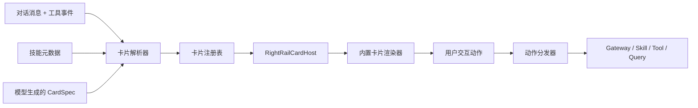
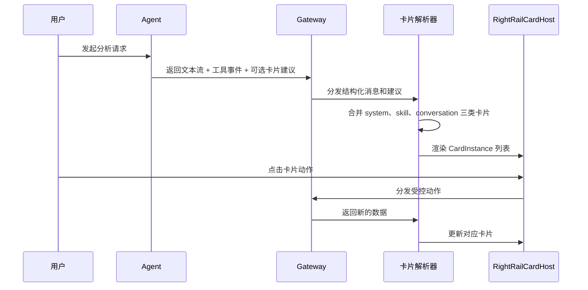

# Power UI 右侧卡片运行时设计

本文描述如何将 `openclaw/power-ui` 当前固定的右侧栏演进为一个动态卡片运行时，用于根据对话内容、技能能力、工具输出和模型建议，在右侧展示不同类型的交互卡片。

这份设计明确采用“受控运行时”思路：

- 大模型生成的是卡片配置，不是任意前端代码
- 卡片由受信任的内置渲染器负责渲染
- 技能可以声明自己支持哪些卡片，但不直接拥有渲染权
- 右侧栏升级为通用卡片宿主，而不是单一文件面板

## 背景

当前 `power-ui` 中已经有两个很重要的基础能力：

- 右侧栏目前是固定的 `Project Files` 卡片
- 聊天区已经支持由工具事件转成结构化消息并展示

相关入口：

- [`openclaw/power-ui/src/views/workbench.ts`](/Users/jingchao/agent_work/power_claw/openclaw/power-ui/src/views/workbench.ts)
- [`openclaw/ui/src/ui/app-tool-stream.ts`](/Users/jingchao/agent_work/power_claw/openclaw/ui/src/ui/app-tool-stream.ts)

也就是说，当前系统已经具备“结构化内容展示”的前提，只是右侧栏还没有抽象成通用卡片宿主。

## 目标

- 让右侧栏能够根据对话上下文展示不同类型的卡片。
- 支持由内置 primitives 组装的卡片，例如文本、指标、表格、图表、代码、关系图、表单等。
- 支持技能声明自己支持或推荐的卡片。
- 支持模型通过返回 `CardSpec` JSON 来建议卡片。
- 在保证安全、可维护和可升级的前提下支持生成式 UI。
- 为后续内部团队或社区贡献卡片预留扩展能力。

## 非目标

- 第一阶段不允许模型直接生成并执行任意 JS、TS、HTML 或 CSS。
- 第一阶段不让每个技能都自己带一个独立前端实现。
- 在卡片协议、校验机制、运行时边界没有稳定之前，不优先做公开市场。

## 产品抽象

右侧栏应该被视为一个“卡片面板”，卡片来源分为三类：

1. `system`
   系统固定卡，例如项目文件、运行状态、上下文信息。
2. `skill`
   某个技能声明的默认卡、推荐卡，或者技能输出驱动的卡。
3. `conversation`
   基于当前对话意图、工具结果或模型建议动态生成的卡。

最终形成统一模型：

- 右侧栏是卡片栈
- 卡片有优先级、有生命周期、有动作
- 每种卡片类型通过受控渲染器渲染

## 设计原则

### 1. 配置优先，不执行生成代码

模型可以生成声明式 `CardSpec`，但不直接生成可执行视图代码。

### 2. 优先使用内置 primitives

大部分卡片应该通过内置 primitives 组合，而不是每张卡单独定制。

### 3. 技能负责绑定，不负责渲染

技能可以推荐或产出某类卡片所需数据，但卡片如何展示仍由卡片运行时统一管理。

### 4. 先做少量高价值卡片

第一版只做少数关键卡片，把协议、交互和状态流打通。

### 5. 要有稳定升级路径

卡片类型、字段和动作都需要版本化，便于后续演进。

## 总体架构



## 运行时分层

运行时建议拆成五层。

### 1. 卡片注册表

定义有哪些卡片类型，以及每种卡片如何渲染。

职责：

- 注册 `cardType`
- 声明 schema 版本
- 校验 payload
- 提供 renderer
- 可选提供动作处理逻辑

### 2. 卡片解析器

负责在当前会话上下文下生成“当前应该展示哪些卡片”。

输入：

- 当前项目
- 当前会话
- 最近消息
- 工具事件
- 技能绑定信息
- 模型建议的卡片

输出：

- 排序后的 `CardInstance[]`

### 3. RightRailCardHost

通用右侧卡片宿主，用于替换当前固定 `renderRightRail()` 的逻辑。

职责：

- 卡片布局
- 卡片排序
- 折叠和展开
- 固定和取消固定
- 焦点控制
- 溢出与滚动

### 4. 内置渲染器

负责渲染受控卡片类型，例如：

- `file-browser`
- `chart-analysis`
- `relation-graph`
- `sql-inspector`
- `power-path`
- 通用 primitive 组装卡

### 5. 动作分发器

负责执行卡片上的交互动作，并保证动作是可控、可校验的。

例如：

- 重跑查询
- 打开文件
- 显示 SQL
- 编辑 SQL
- 重新生成图表
- 高亮专供路径

## 核心类型设计

建议在 `power-ui` 或共享 UI 协议层引入以下类型。

```ts
export type CardSource = "system" | "skill" | "conversation";

export type CardPlacement = "right-rail" | "inline-message" | "both";

export type CardPriority = "pinned" | "high" | "normal" | "low";

export type CardLifecycle = "ephemeral" | "session" | "project" | "persistent";

export type CardDefinition = {
  type: string;
  version: string;
  title: string;
  description?: string;
  placement: CardPlacement[];
  renderer: "primitive" | "custom";
  schema: Record<string, unknown>;
};

export type CardInstance = {
  id: string;
  type: string;
  version: string;
  source: CardSource;
  placement: CardPlacement;
  priority: CardPriority;
  lifecycle: CardLifecycle;
  title: string;
  subtitle?: string;
  sessionKey?: string;
  projectId?: string;
  skillKey?: string;
  status?: "ready" | "loading" | "error" | "stale";
  dismissible?: boolean;
  pinnable?: boolean;
  generatedBy?: "system" | "skill" | "model";
  payload: Record<string, unknown>;
  actions?: CardAction[];
  updatedAt: number;
};

export type CardAction = {
  id: string;
  label: string;
  kind:
    | "gateway-request"
    | "open-file"
    | "open-session"
    | "copy"
    | "download"
    | "rerender"
    | "emit-prompt"
    | "custom";
  params?: Record<string, unknown>;
  confirm?: {
    title: string;
    body: string;
  };
};
```

## 基于 Primitive 的 CardSpec

生成式卡片应优先走 primitive 组合模式，这样最安全，也最容易长期维护。

```ts
export type PrimitiveNode =
  | { kind: "text"; text: string; tone?: "default" | "muted" | "success" | "danger" }
  | { kind: "kpi"; label: string; value: string; delta?: string }
  | { kind: "table"; columns: string[]; rows: Array<Array<string | number | null>> }
  | { kind: "code"; language: string; content: string; editable?: boolean }
  | { kind: "chart"; chartType: "line" | "bar" | "pie" | "scatter"; spec: Record<string, unknown> }
  | { kind: "tabs"; tabs: Array<{ key: string; label: string; children: PrimitiveNode[] }> }
  | { kind: "form"; fields: Array<Record<string, unknown>> }
  | { kind: "graph"; graphType: "relation" | "topology"; spec: Record<string, unknown> }
  | { kind: "stack"; gap?: "xs" | "sm" | "md" | "lg"; children: PrimitiveNode[] }
  | { kind: "split"; ratio?: "1:1" | "2:1" | "1:2"; left: PrimitiveNode[]; right: PrimitiveNode[] };

export type CardSpec = {
  version: "card-spec/v1";
  type: string;
  title: string;
  subtitle?: string;
  summary?: string;
  priority?: CardPriority;
  placement?: CardPlacement[];
  body: PrimitiveNode[];
  actions?: CardAction[];
};
```

## 为什么模型应该生成 CardSpec，而不是直接生成代码

如果模型直接生成 UI 代码：

- 前端必须做代码沙箱
- 调试复杂度高
- 升级和兼容成本极大
- 后续社区开放会直接引入审核压力
- 视觉一致性也难以保证

如果模型只生成 `CardSpec`：

- 可以做 schema 校验
- UI 始终落在统一设计系统里
- 渲染行为可预测
- 出错时可以直接丢弃卡片，不影响主会话

## 技能绑定模型

技能应该可以声明自己支持哪些卡片，但不直接接管渲染。

建议扩展：

```ts
export type SkillCardBinding = {
  cardType: string;
  mode: "optional" | "default" | "recommended";
  triggerIntents?: string[];
  produces?: string[];
  description?: string;
};

export type SkillStatusEntry = {
  ...
  cards?: SkillCardBinding[];
};
```

语义：

- `optional`
  技能支持这类卡，但不会自动挂载。
- `default`
  技能启用且数据可用时默认挂载。
- `recommended`
  当前上下文适合时可以提示用户启用。

示例：

### 数据分析技能

```json
{
  "cards": [
    { "cardType": "chart-analysis", "mode": "default" },
    { "cardType": "sql-inspector", "mode": "recommended" },
    { "cardType": "relation-graph", "mode": "optional" }
  ]
}
```

### 电网负荷专供分析技能

```json
{
  "cards": [
    { "cardType": "power-path", "mode": "default" },
    { "cardType": "chart-analysis", "mode": "recommended" }
  ]
}
```

## 卡片来源与解析规则

解析器需要把不同来源的卡片合并成一个统一列表。

### 解析优先级

1. 已固定卡片
2. 系统强依赖卡片
3. 技能默认卡且已有数据
4. 工具或模型建议的对话卡片
5. 尚未激活的推荐卡片

### 去重规则

卡片优先按以下方式去重：

- 显式 `id`
- 否则使用 `(type, sessionKey, projectId, skillKey, payload 语义哈希)`

### 替换规则

当满足以下条件时，新卡替换旧卡：

- 语义身份一致
- `updatedAt` 更新
- 数据更新或版本更高

### 关闭规则

- `ephemeral` 只在当前会话临时存在
- `session` 在当前会话内持续存在
- `project` 在同一项目下跨会话持续
- `persistent` 由用户显式固定或保存

## 右侧栏 UX 模型

右侧栏应当从“固定文件卡”升级为“通用卡片栈”。

建议行为：

- 顶部保留折叠按钮和过滤入口
- 卡片分为 pinned 区和普通区
- 普通区支持滚动
- 每张卡片支持菜单：
  - 固定
  - 关闭
  - 刷新
  - 查看原始 payload

### 第一批系统卡建议

- `file-browser`
- `run-status`
- `current-skill-context`

其中当前已有文件浏览器应被重构为 `file-browser` 卡渲染器，而不是继续作为右侧栏的特例存在。

## 行内卡片与右侧卡片

有些卡应该既能在消息流里展示，也能在右侧以增强版展示。

例如：

- 聊天消息中显示一个简版图表摘要
- 右侧栏显示完整可交互图表卡

建议规则：

- 聊天区负责叙述
- 右侧栏负责持续交互和深入查看

这样可以避免线程中塞满复杂交互组件。

## 动作模型

卡片动作必须经过统一分发器，不能让渲染器随意执行任意字符串回调。

建议动作分类：

- `gateway-request`
  调用一个受控 gateway 方法
- `open-file`
  打开文件预览或定位文件
- `emit-prompt`
  向当前会话发送追问
- `rerender`
  用当前上下文重新生成卡片
- `copy`
  复制 SQL、图表配置或摘要内容

示例：

### SQL 检查卡动作

- `查看结果`
- `编辑 SQL`
- `重新执行`
- `复制 SQL`

### 专供路径卡动作

- `高亮上游路径`
- `切换电压层级`
- `查看关联负荷`

## 关键卡片的数据契约

第一阶段建议聚焦少量高价值卡片。

### 1. `relation-graph`

适用场景：

- 链接关系图
- 实体关系图
- 依赖关系图

Payload 示例：

```ts
type RelationGraphPayload = {
  nodes: Array<{ id: string; label: string; kind?: string; meta?: Record<string, unknown> }>;
  edges: Array<{ id: string; source: string; target: string; label?: string; kind?: string }>;
  layout?: "force" | "dagre";
  legend?: Array<{ kind: string; label: string }>;
};
```

### 2. `chart-analysis`

适用场景：

- 分析结果图表
- KPI 趋势
- 分类对比

Payload 示例：

```ts
type ChartAnalysisPayload = {
  chartType: "line" | "bar" | "pie" | "scatter";
  title?: string;
  description?: string;
  dataset: Record<string, unknown>;
  insightSummary?: string[];
  sourceTable?: {
    columns: string[];
    rows: Array<Array<string | number | null>>;
  };
};
```

### 3. `sql-inspector`

适用场景：

- 展示生成的 SQL
- 查看和编辑查询
- 重跑查询并比较结果

Payload 示例：

```ts
type SqlInspectorPayload = {
  sql: string;
  dialect?: "mysql" | "postgres" | "sqlite" | "spark" | "unknown";
  editable?: boolean;
  params?: Record<string, unknown>;
  previewResult?: {
    columns: string[];
    rows: Array<Array<string | number | null>>;
    totalRows?: number;
  };
};
```

### 4. `power-path`

适用场景：

- 电网专供路径展示
- 上下游路径查看
- 指定负荷溯源

Payload 示例：

```ts
type PowerPathPayload = {
  pathId: string;
  loadName: string;
  sourceName?: string;
  voltageLevel?: string;
  nodes: Array<{
    id: string;
    label: string;
    type: "plant" | "station" | "transformer" | "line" | "switch" | "load";
    status?: string;
  }>;
  segments: Array<{
    id: string;
    from: string;
    to: string;
    label?: string;
    status?: string;
  }>;
  summary?: {
    hopCount?: number;
    riskLevel?: string;
    remarks?: string[];
  };
};
```

## 模型接入方式

模型应该通过一个窄协议返回卡片建议。

示例：

```json
{
  "type": "ui.card.suggestion",
  "cards": [
    {
      "version": "card-spec/v1",
      "type": "chart-analysis",
      "title": "负荷波动趋势",
      "priority": "high",
      "placement": ["right-rail"],
      "body": [
        {
          "kind": "chart",
          "chartType": "line",
          "spec": {}
        }
      ],
      "actions": [
        {
          "id": "show-sql",
          "label": "查看 SQL",
          "kind": "emit-prompt",
          "params": { "prompt": "请展示生成该图表的 SQL，并允许编辑。" }
        }
      ]
    }
  ]
}
```

### 校验流程

1. 解析 assistant payload
2. 按 `CardSpec` schema 校验
3. 转成 `CardInstance`
4. 交给内置渲染器渲染
5. 校验失败则丢弃，不影响主流程

## 事件流建议



## 后端与协议演进

这套能力可以先前端落地，但长期看更适合补一个专门的卡片协议层。

后续可选方法：

- `ui.cards.resolve`
- `ui.cards.dismiss`
- `ui.cards.pin`
- `ui.cards.action`

后续可选事件：

- `ui.card.upsert`
- `ui.card.remove`
- `ui.card.batch`

第一阶段不强依赖新协议，卡片完全可以先从这些数据源本地推导：

- 现有聊天消息
- 现有工具事件
- 技能元数据
- 当前 UI 状态

## 安全模型

右侧栏是高价值交互面板，不能把模型生成代码直接跑进去。

### 第一阶段允许

- 模型生成声明式 `CardSpec`
- 内置渲染器负责展示
- 动作参数统一校验
- 自定义卡片必须由应用内置

### 第一阶段不允许

- 模型直接生成并执行 JS
- 任意 HTML 注入
- 远程社区代码直接加载到右侧栏

### 如果未来要开放社区卡片

建议分两级：

1. `Spec Template`
   只能使用 primitives 组合，风险低。
2. `Custom Renderer`
   必须审核、签名、版本化发布，风险高。

## 建议的代码改造方向

基于当前 `power-ui` 目录结构，建议新增以下模块。

### 新增协议类型

- `openclaw/power-ui/src/cards/types.ts`
- `openclaw/power-ui/src/cards/spec.ts`
- `openclaw/power-ui/src/cards/registry.ts`

### 新增运行时模块

- `openclaw/power-ui/src/cards/resolve-cards.ts`
- `openclaw/power-ui/src/cards/card-actions.ts`
- `openclaw/power-ui/src/cards/system-cards.ts`

### 新增卡片渲染器

- `openclaw/power-ui/src/cards/renderers/file-browser-card.ts`
- `openclaw/power-ui/src/cards/renderers/chart-analysis-card.ts`
- `openclaw/power-ui/src/cards/renderers/sql-inspector-card.ts`
- `openclaw/power-ui/src/cards/renderers/relation-graph-card.ts`
- `openclaw/power-ui/src/cards/renderers/power-path-card.ts`

### Workbench 集成点

- 用 `RightRailCardHost` 替换当前 `renderRightRail()` 的特例实现
- 将现有文件浏览器改造成 `file-browser` 卡片渲染器
- 为 session runtime 增加卡片状态

建议状态：

```ts
type SessionRuntimeState = {
  ...
  activeCards: CardInstance[];
  dismissedCardIds: string[];
  pinnedCardIds: string[];
  modelCardSuggestions: CardSpec[];
};
```

## 分阶段实施计划

### Phase 1：卡片宿主和第一个系统卡迁移

范围：

- 引入 `CardDefinition` 和 `CardInstance`
- 增加 `RightRailCardHost`
- 把现有文件浏览器迁移为 `file-browser` 卡

完成标准：

- 现有功能无回归
- 右侧栏正式变成通用卡片宿主

### Phase 2：结构化分析卡

范围：

- 增加 `chart-analysis`
- 增加 `sql-inspector`
- 建立动作分发器

完成标准：

- 分析结果可以沉淀在右侧栏
- SQL 可以查看、复制、修改、重跑

### Phase 3：技能绑定

范围：

- 给技能元数据增加 `cards`
- 技能启用后可自动挂载默认卡

完成标准：

- 技能和卡片形成可配置绑定关系

### Phase 4：模型生成 CardSpec

范围：

- 接入 `ui.card.suggestion`
- 校验并渲染模型建议卡片

完成标准：

- 模型可以安全地产生右侧卡片，而不生成代码

### Phase 5：领域卡片

范围：

- 增加 `relation-graph`
- 增加 `power-path`

完成标准：

- 链接关系图和电网专供路径成为一等交互能力

### Phase 6：外部贡献机制

范围：

- 设计 spec-template 贡献格式
- 建立审核流程和版本策略

完成标准：

- 团队或社区能贡献安全卡片而不破坏运行时

## 待确认问题

在进入 Phase 4 之前，建议明确以下问题。

1. 卡片是存入 session 历史，还是每次从消息和工具结果重建？
2. 卡片动作第一阶段是否全部走前端本地分发，还是提前抽 gateway 方法？
3. 同一项目多个会话时，哪些卡片应跨会话保留？
4. 图表和关系图长期使用哪套默认渲染库？
5. 卡片是否默认支持“行内 + 右侧”双位置，还是必须显式声明？

## 建议默认决策

为了尽快落地，建议第一版默认如下：

- pinned 和 dismissed 状态先保存在本地 UI
- 非持久卡片优先从最近会话状态重建
- 模型生成的卡片只允许 primitive-based 渲染
- 先把 `file-browser` 作为 system card 迁进去验证宿主能力
- 首批只做四类卡：
  - `file-browser`
  - `chart-analysis`
  - `sql-inspector`
  - `power-path`

## 总结

这个方案真正应该建设的不是“卡片库”本身，而是“受控卡片运行时”。

这套运行时应该提供：

- 稳定的卡片协议
- 可信的渲染注册表
- 通用右侧卡片宿主
- 技能与卡片绑定机制
- 安全的模型生成 `CardSpec` 能力

这样 `power-ui` 才能从一个固定右侧栏，演进成面向业务场景的交互工作台，同时不牺牲安全性和可维护性。
