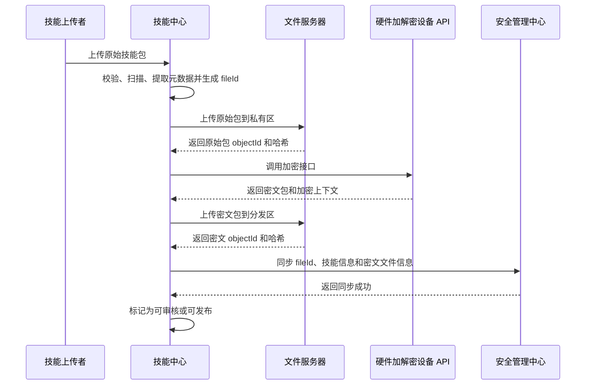

# 技能中心加密分发集成方案

## 1. 最终职责划分

### 1.1 技能中心

- 接收、校验和审核原始技能包。
- 调用硬件加解密设备 API 加密技能包。
- 将原始包和密文包上传到文件服务器备份。
- 为每个加密技能生成全局唯一 `fileId`。
- 将加密技能、`fileId` 和文件信息同步到安全管理中心。
- 继续提供技能目录、详情、版本和安装事件等业务接口。

### 1.2 安全管理中心

- 保存同步过来的加密技能记录和唯一 `fileId`。
- 提供技能列表和技能详情能力。
- 根据 `fileId` 校验盒子身份，并返回密文文件的完整短时 URL。
- 记录文件授权和访问审计。
- **不负责技能加密或解密，也不持有加解密密钥。**

### 1.3 盒子端

- 对技能中心接口提供统一透明代理，保持原 URL、参数、状态码和响应内容，不处理技能中心业务数据。
- 根据 `fileId` 调用安全管理中心获取密文文件完整 URL。
- 从文件服务器下载密文包。
- 调用硬件加解密设备 API 解密。
- 通过本机接口向 Agent 返回明文技能包。

### 1.4 Agent

- 通过盒子端透明代理访问技能中心业务接口。
- 安装技能时，使用 `fileId` 调用盒子端解密下载接口。
- 接收明文技能包并执行现有安装、扫描、用户隔离和卸载流程。
- 不访问安全管理中心、文件服务器或硬件加解密设备。

### 1.5 基础设施

- **文件服务器**：分别保存原始包和密文包。
- **硬件加解密设备及 API**：统一执行技能包加密和解密，技能中心与盒子端分别调用。

## 2. 目标调用链

### 2.1 技能上传、加密和同步



### 2.2 Agent 查询、下载和解密

```mermaid
sequenceDiagram
    participant AGENT as Agent
    participant BOX as 盒子端
    participant SC as 技能中心
    participant SEC as 安全管理中心
    participant FS as 文件服务器
    participant CRYPTO as 硬件加解密设备 API

    AGENT->>BOX: 查询技能目录（原技能中心 URL）
    BOX->>SC: 透明转发请求
    SC-->>BOX: 返回技能信息和 fileId
    BOX-->>AGENT: 原样返回响应
    AGENT->>BOX: 根据 fileId 调用解密下载接口
    BOX->>SEC: 根据 fileId 获取密文完整 URL
    SEC-->>BOX: 返回短时 URL、密文哈希和加密上下文
    BOX->>FS: 使用短时 URL 下载密文包
    FS-->>BOX: 返回密文包
    BOX->>BOX: 校验密文大小和哈希
    BOX->>CRYPTO: 提交密文、fileId 和加密上下文
    CRYPTO-->>BOX: 返回明文技能包和明文哈希
    BOX->>BOX: 校验明文哈希并清理临时文件
    BOX-->>AGENT: 返回明文技能包
    AGENT->>AGENT: 扫描、解压并安装到用户技能目录
    AGENT->>BOX: 上报安装事件（原技能中心 URL）
    BOX->>SC: 透明转发安装事件
```

安全管理中心在以上链路中只负责保存技能密文记录、根据 `fileId` 授权密文 URL，不调用硬件加解密设备。

## 3. 核心标识与数据模型

### 3.1 fileId 规则

- `fileId` 由技能中心在加密前生成。
- 建议使用 UUIDv7 或 ULID，保证全局唯一且不包含业务敏感信息。
- 一个 `fileId` 唯一对应一个技能版本的一份密文制品。
- 同一技能版本重新加密后，应生成新的 `fileId`，旧记录进入停用或归档状态。
- `fileId` 创建后不可修改，技能中心、安全管理中心、盒子端必须使用同一个值。

### 3.2 技能版本元数据

```json
{
  "fileId": "019f-skill-file-id",
  "slug": "peer-review",
  "version": "1.0.0",
  "fileName": "peer-review-1.0.0.zip",
  "contentType": "application/zip",
  "sourceFile": {
    "objectId": "source-object-id",
    "sha256": "plaintext-sha256",
    "size": 120000
  },
  "encryptedFile": {
    "objectId": "encrypted-object-id",
    "sha256": "ciphertext-sha256",
    "size": 123456
  },
  "crypto": {
    "provider": "hardware-crypto-device",
    "format": "hardware-crypto-v1",
    "context": "opaque-crypto-context"
  },
  "status": "ready",
  "createdAt": 1784700000000
}
```

安全管理中心只需要保存密文制品相关信息，不需要保存原始包的可下载地址。

## 4. 技能中心上传流程

```text
接收原始技能包
  -> 写入受限临时目录
  -> 解压、安全扫描、提取 SKILL.md
  -> 计算原始包 SHA-256
  -> 生成唯一 fileId
  -> 上传原始包到文件服务器私有区
  -> 调用硬件设备加密 API
  -> 计算或校验密文 SHA-256
  -> 上传密文包到文件服务器密文分发区
  -> 保存技能版本及双文件元数据
  -> 调用安全管理中心新增技能同步接口
  -> 同步成功后允许进入审核或发布状态
  -> 删除技能中心本机临时文件
```

建议状态：

```text
validating
  -> source_uploaded
  -> encrypting
  -> encrypted_uploaded
  -> security_syncing
  -> ready
  -> pending_review / approved
```

异常处理：

- 原始包上传失败：终止流程。
- 加密失败：保留私有原始包供重试，不允许发布。
- 密文上传失败：重新上传密文，不允许发布。
- 安全管理中心同步失败：按 `fileId` 幂等重试，不重复创建技能记录。
- 数据库保存失败：通过后台对账任务清理孤儿文件或补齐元数据。

## 5. 文件服务器逻辑接口

文件服务器可以采用现有 API 或 S3 兼容对象存储，技能中心至少需要以下能力：

| 操作         | 用途                                     |
| ------------ | ---------------------------------------- |
| 上传原始包   | 保存到仅技能中心受限账号可访问的私有区。 |
| 上传密文包   | 保存到密文分发区。                       |
| HEAD 文件    | 校验对象大小、ETag 和 SHA-256。          |
| 生成短时 URL | 仅为密文对象生成短时完整下载 URL。       |
| 删除文件     | 上传回滚、版本删除和孤儿对象清理。       |

建议对象路径：

```text
skill-source-private/{slug}/{version}/{fileId}/{fileName}
skill-encrypted-release/{slug}/{version}/{fileId}.enc
```

约束：

- 原始包和密文包必须位于不同存储区并使用不同读取权限。
- 原始包不进行业务加密，但仍建议启用文件服务器自身的磁盘透明加密。
- 安全管理中心和盒子端只能获得密文文件访问权限。
- 生产环境不能根据 `fileId` 获取原始包 URL。
- 短时 URL 需要绑定文件、调用方和过期时间。

## 6. 硬件加解密设备 API

实际接口路径可适配已有硬件设备，业务上需要以下两个核心接口。

### 6.1 加密接口

调用方：技能中心。

```http
POST /api/crypto/v1/encrypt
Authorization: Bearer {skillCenterCryptoToken}
Content-Type: multipart/form-data
```

请求内容：

- 原始技能包。
- `fileId`、`slug`、版本和原始包 SHA-256。
- 请求 ID，用于幂等和审计。

响应内容：

- 密文技能包二进制。
- 加密格式和不透明加密上下文。
- 原始包及密文包 SHA-256。
- 硬件操作流水号。

### 6.2 解密接口

调用方：盒子端。

```http
POST /api/crypto/v1/decrypt
Authorization: Bearer {boxCryptoToken}
X-Device-Id: {deviceId}
Content-Type: multipart/form-data
```

请求内容：

- 从文件服务器下载的密文技能包。
- `fileId`、密文 SHA-256 和不透明加密上下文。
- 请求 ID，用于审计和问题追踪。

响应内容：

- 明文技能包二进制。
- 明文 SHA-256。
- 原始文件名和内容类型。

安全要求：

- 加密接口只允许技能中心服务账号调用。
- 解密接口只允许已登记盒子调用。
- 技能中心和盒子端使用不同凭证和权限。
- API 必须使用 HTTPS，优先采用双向 TLS。
- 不在日志中记录密钥、凭证、明文或完整技能内容。
- 解密失败或哈希不一致时不得返回部分明文。

## 7. 技能中心需要调用的新增接口

### 7.1 同步加密技能到安全管理中心

```http
POST /api/security/v1/skills/sync
Authorization: Bearer {skillCenterSecurityToken}
Idempotency-Key: {fileId}
Content-Type: application/json
```

请求示例：

```json
{
  "fileId": "019f-skill-file-id",
  "slug": "peer-review",
  "displayName": "Peer Review",
  "version": "1.0.0",
  "fileName": "peer-review-1.0.0.zip",
  "contentType": "application/zip",
  "encryptedFile": {
    "objectId": "encrypted-object-id",
    "sha256": "ciphertext-sha256",
    "size": 123456
  },
  "crypto": {
    "format": "hardware-crypto-v1",
    "context": "opaque-crypto-context"
  },
  "status": "active",
  "publishedAt": 1784700000000
}
```

响应示例：

```json
{
  "ok": true,
  "fileId": "019f-skill-file-id",
  "syncStatus": "created"
}
```

同一个 `fileId` 重试时必须返回相同结果；如果请求内容与已保存内容冲突，返回 `409 FILE_ID_CONFLICT`。

### 7.2 可选批量同步接口

用于历史技能迁移和失败补偿：

```http
POST /api/security/v1/skills/batch-sync
```

该接口属于 P1，不影响首期单技能上传流程。

## 8. 安全管理中心新增接口

### 8.1 技能列表

```http
GET /api/security/v1/skills?q={q}&status={status}&page={page}&limit={limit}
Authorization: Bearer {authorizedServiceToken}
```

用于安全管理中心后台展示已同步技能、版本、`fileId`、密文状态和访问记录。

### 8.2 新增或更新技能同步

```http
POST /api/security/v1/skills/sync
```

由技能中心调用，按 `fileId` 幂等保存密文文件信息。

### 8.3 根据 fileId 获取密文完整 URL

```http
GET /api/security/v1/files/{fileId}/encrypted-url
Authorization: Bearer {boxSecurityToken}
X-Device-Id: {deviceId}
```

响应示例：

```json
{
  "fileId": "019f-skill-file-id",
  "downloadUrl": "https://files.example.invalid/download/signed-token",
  "expiresAt": 1784700300000,
  "encryptedFile": {
    "sha256": "ciphertext-sha256",
    "size": 123456
  },
  "crypto": {
    "format": "hardware-crypto-v1",
    "context": "opaque-crypto-context"
  }
}
```

接口约束：

- 只返回密文 URL。
- 校验盒子身份和技能状态。
- URL 有效期建议不超过 5 分钟。
- 每次签发都记录 `fileId`、设备、时间和结果。
- 技能停用、撤回或文件不存在时拒绝签发。
- 安全管理中心不下载密文，也不调用硬件解密接口。

## 9. 盒子端向 Agent 提供的包装接口

盒子端只提供两类能力：

| 能力             | URL 规则                                                 | 处理方式                                                   |
| ---------------- | -------------------------------------------------------- | ---------------------------------------------------------- |
| 技能中心透明代理 | 保持技能中心原 URL 不变，例如 `/api/ui/*`、`/api/v1/*`。 | 只转发请求和响应，不解析或修改业务数据。                   |
| 技能解密下载     | `GET /api/box/v1/files/{fileId}/decrypt`                 | 盒子获取密文 URL、下载密文、调用硬件设备解密并返回明文包。 |

因此，`/api/ui/catalog`、`/api/v1/skills/{slug}/install-event` 以及技能中心的其他业务接口都只是同一个透明代理能力，不需要在盒子端逐个开发处理逻辑。代理接口应采用允许路径清单，不能把技能中心管理接口无条件暴露给 Agent。

### 9.1 解密下载接口处理流程

```http
GET /api/box/v1/files/{fileId}/decrypt
```

该接口只监听 `127.0.0.1`，供本机 Agent 调用。

盒子内部流程：

```text
校验 fileId
  -> 调用安全管理中心获取密文完整 URL
  -> 下载密文包
  -> 校验密文大小和 SHA-256
  -> 调用硬件设备解密 API
  -> 校验明文 SHA-256
  -> 以原始文件名和 Content-Type 返回明文包
  -> 清理临时文件
```

成功响应：

```http
Content-Type: application/zip
Content-Disposition: attachment; filename="peer-review-1.0.0.zip"
X-Skill-File-Id: 019f-skill-file-id
X-Skill-SHA256: plaintext-sha256
```

建议错误码：

| HTTP 状态 | 错误码                        | 说明                                         |
| --------- | ----------------------------- | -------------------------------------------- |
| `400`     | `INVALID_FILE_ID`             | `fileId` 格式错误。                          |
| `401`     | `BOX_AUTH_FAILED`             | 盒子访问安全管理中心或硬件设备鉴权失败。     |
| `403`     | `FILE_NOT_AUTHORIZED`         | 安全管理中心拒绝签发 URL。                   |
| `404`     | `FILE_NOT_FOUND`              | 安全管理中心或文件服务器中不存在该文件。     |
| `410`     | `FILE_DISABLED`               | 技能已停用或撤回。                           |
| `422`     | `INTEGRITY_FAILED`            | 密文或明文哈希校验失败。                     |
| `502`     | `UPSTREAM_FAILED`             | 安全管理中心、文件服务器或硬件设备调用失败。 |
| `503`     | `DECRYPT_SERVICE_UNAVAILABLE` | 硬件解密服务不可用。                         |

## 10. Agent 需要修改的接口

Agent 继续把盒子端作为技能服务地址：

1. 技能中心现有接口保持原 URL，通过盒子透明代理访问。
2. 技能目录响应增加当前技能版本的 `fileId`。
3. 安装时不再调用旧下载地址，改为调用盒子专用解密接口：

```http
GET /api/box/v1/files/{fileId}/decrypt
```

4. Agent 收到明文压缩包后继续使用现有校验、扫描、解压和用户目录安装逻辑。
5. 安装事件仍按技能中心原 URL 调用，由盒子透明转发。

Power UI 现有技能 RPC 属于 Agent 内部协议，保持不变。Agent 只需要新增 `fileId` 和独立解密下载地址的适配。

## 11. 安全边界

- 原始包只保存在文件服务器私有区，不能通过安全管理中心或盒子端获取。
- 安全管理中心只管理密文文件记录和 URL 授权，不参与加解密。
- 盒子端不保存硬件设备密钥，只保存调用凭证。
- 盒子端明文接口只绑定 `127.0.0.1`。
- 密文 URL 必须短时有效，不能写入长期日志或数据库。
- 解密后的明文优先流式返回；临时文件必须限制权限并及时删除。
- Agent 安装后的技能目录是明文，因此本方案不保护盒子安装后的技能内容。
- 用户本地上传技能不经过该加密链路，来源继续标记为 `directory`。

## 12. 工作量评估

| 责任方       | 主要工作                                                       |       估算 |
| ------------ | -------------------------------------------------------------- | ---------: |
| 技能中心     | 双文件上传、硬件加密调用、`fileId`、安全中心同步、状态和补偿。 | 8～13 人日 |
| 安全管理中心 | 技能列表、同步接口、密文 URL 接口、鉴权和审计。                | 6～10 人日 |
| 盒子端       | 通用透明代理、安全中心客户端、密文下载、硬件解密和明文接口。   | 6～10 人日 |
| Agent        | `fileId` 协议、解密下载接口适配和安装回归。                    |  2～4 人日 |
| 文件服务器   | 双存储区、权限、短时 URL、哈希、审计和生命周期。               |  3～6 人日 |
| 硬件设备 API | 加解密接口适配、调用鉴权、流式处理和测试。                     |  3～7 人日 |
| 联调验收     | 全链路、异常恢复、权限和历史数据迁移。                         |  4～7 人日 |

总体估算：**32～57 人日**。如果文件服务器和硬件设备 API 已完整可用，首期联调可缩减约 5～9 人日。

## 13. 验收标准

1. 同一技能版本拥有唯一且一致的 `fileId`。
2. 文件服务器同时存在原始包和密文包，大小与 SHA-256 正确。
3. 原始包私有区不能被安全管理中心、盒子或 Agent 访问。
4. 技能中心同步失败可以按 `fileId` 幂等重试。
5. 安全管理中心可以展示技能列表，并根据有效 `fileId` 为授权盒子返回密文短时 URL。
6. 安全管理中心不执行加密或解密。
7. 盒子可以完成“获取 URL、下载密文、调用硬件解密、返回明文”的完整流程。
8. 修改 `fileId`、密文或哈希后必须拒绝安装。
9. Agent 不访问安全管理中心、文件服务器或硬件设备，仍能完成技能安装。
10. 用户技能继续按用户目录隔离，程序升级后不会丢失。

## 14. 推荐实施顺序

1. 确定 `fileId`、双文件元数据和错误码。
2. 确认文件服务器及硬件加解密 API 的实际协议。
3. 技能中心完成原始包上传、加密、密文上传和安全中心同步。
4. 安全管理中心完成技能同步、技能列表和密文 URL 接口。
5. 盒子端完成技能中心透明代理和 `fileId` 解密下载接口。
6. Agent 接入 `fileId` 和盒子解密下载接口。
7. 完成异常重试、审计、权限和历史技能迁移测试。
